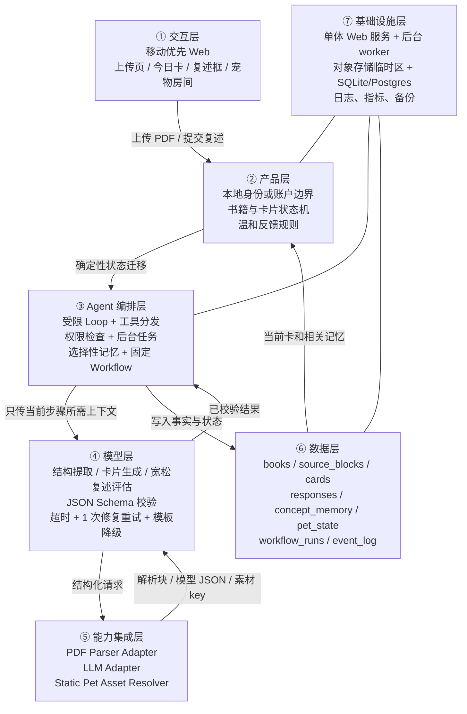

# 「读书养宠」Agent 产品方案

> 生成日期：2026-09-16  
> 来源标注：**第 0–15 节**由 Codex 会话「规划读书养宠产品」生成（2026-09-16 16:56:51，25,296 字节）；**第 16–17 节**由本次会话（pi，模型 DeepSeek V4.1 Flash / high）于 17:22 追加。两段都是「AI 按手册分析」的产物，都未运行引擎模型管线。  
> 修订：2026-09-16 第二轮复查，补充第 16 节（技术适配核验清单）与第 17 节（待你回答的问题速览）  
> 执行方式：**当前 AI 按 Agent Blueprint 手册分析，未运行模型管线**。引擎检测到模型配置不可用；未使用 `--mock`，因此本文不是占位演示，也没有伪造程序阶段、模型用量、独立模型审稿或 `plan.json`。  
> 本次范围：方案，不生成产品代码。  
> 证据边界：下列 GitHub Stars、创建日期、License 和 Product Hunt 描述来自用户输入，本次未联网复核；它们只能作为候选来源，正式采用依赖前须核验当前 README、License、API 和可运行性。

## 0. 一句话结论

先做一个**单用户、单本文本型 PDF、每天一张 5 分钟任务卡**的 Web MVP：用户读完节选并写一句复述，系统把可观察的阅读行为转成一份“知识食物”，静态宠物和房间出现一次内容相关变化；产品用温和反馈鼓励继续阅读，不使用连续打卡、排行榜或惩罚。

真正需要验证的不是“AI 能不能拆书”，而是：**宠物反馈能否让用户愿意连续三次完成原本会拖延的阅读任务，同时仍记得刚读过的核心观点。**

---

## 1. 待确认问题（本轮最多 5 个）

### Q1｜第一批用户是谁？

- 问题：首批验证面向成人自主阅读者，还是家长陪伴下的儿童？
- 选项：A 成人非虚构阅读者；B 亲子/儿童朗读；C 两者都做。
- 推荐：**A**。成人上传自有 PDF，交互和合规更简单，也更贴合“复述观点”。
- 不选的后果：若选 B，要增加儿童隐私、家长同意、朗读识别和内容分级；选 C 会让首版范围失焦。

### Q2｜宠物什么时候算“吃到知识”？

- 问题：用户只要提交复述就喂养，还是必须达到内容相关性门槛？
- 选项：A 提交即喂养；B 达到宽松相关性门槛；C 严格判对才喂养。
- 推荐：**B**。只检查是否提到一个来自本段的关键点；不做考试式对错判断。
- 不选的后果：A 容易被敷衍输入骗过；C 会把轻松阅读变成测验并增加误判挫败。

### Q3｜文件和阅读记录保存在哪里、多久？

- 问题：PDF 原文、解析文本、复述和阅读记忆分别保留多久？
- 选项：A 全部只存在本机；B 云端保存到用户主动删除；C 云端短期保存原文、长期只留结构和进度。
- 推荐：**C**。原 PDF/解析全文默认 7 天后删除，长期仅保留必要节选引用、任务、复述、薄弱概念和进度；删除入口始终可见。
- 不选的后果：A 最省隐私但跨设备困难；B 实现容易，却扩大版权、隐私和存储风险。

### Q4｜一本书如何切成“每天 5 分钟”？

- 问题：用户是否输入目标完成日期，还是系统按固定字数自动排？
- 选项：A 每卡固定 800–1200 字；B 用户选择完成周期；C 系统按章节难度动态估算。
- 推荐：**A**。首版按文本长度切卡，并避免在标题、段落或表格中间截断。
- 不选的后果：B 需要重排计划；C 需要阅读时长模型和更多行为数据，超出低难度 MVP。

### Q5｜如何验证这个 MVP 值得继续做？

- 问题：首轮最重要的是复访、读完、记住，还是付费？
- 选项：A 7 天复访；B 三次任务完成率；C 复述质量；D 付费意愿。
- 推荐：**以 B 为主、C 为护栏**：至少 10 位目标用户中，6 位在 7 天内完成 3 张卡；已提交复述中 70% 能提到本段一个关键点。
- 不选的后果：只看复访可能是来看宠物；只看答题质量无法证明产品有持续动力；首轮直接看付费样本太小。

### 可先按默认值推进的事项

- 首版不登录，使用浏览器本地身份；验证多人或跨设备需求后再加账号。
- 同一时间只允许一本“正在读”的书；换书前保留旧书进度，但不并行排任务。
- 宠物首版仅 4 个预制静态状态：饥饿、吃到知识、消化中、长出一个主题物件。
- 不发每日通知；用户打开产品时看到当天卡片。
- 不做扫描 PDF、OCR、EPUB、DOCX、语音朗读、社交、连续打卡、排行榜、商城。

---

## 2. Step 1：需求硬事实

| 维度 | 已知事实 | 待确认 / 假设 |
|---|---|---|
| 目标 | 把一本书变成每天 5 分钟的可完成阅读任务，并用宠物成长提供反馈 | 成功指标采用 Q5 推荐值，待确认 |
| 用户 | 用户上传自己可阅读的文本型 PDF；每天同步完成一张卡 | 成人还是儿童，待 Q1 确认 |
| 核心闭环 | 上传 PDF → 解析和切卡 → 阅读节选 → 回答一道复述题 → 宽松评估 → 喂养宠物 → 保存进度与薄弱点 | 是否必须正确才喂养，待 Q2 确认 |
| 交付物 | 当日阅读卡、一道复述题、反馈语、一次宠物/房间变化、下一次阅读位置 | 任务字数和排期方式待 Q4 确认 |
| 边界 | 首版只支持文本型 PDF；静态宠物；不做排行榜和连续打卡压力 | 文件留存规则待 Q3 确认 |
| 约束 | 低难度 MVP；解析可后台运行；模型输出必须结构化校验；失败不能伪装成功 | 模型厂商、单本书成本上限、最大页数待技术适配时确定 |

### 核心状态机

```text
UPLOADED
  → VALIDATING
  → PARSING
  → STRUCTURING
  → READY
  → CARD_AVAILABLE
  → READING
  → ANSWER_SUBMITTED
  → EVALUATED
  → FED
  → NEXT_CARD_AVAILABLE

任一处理步骤失败 → FAILED_RETRYABLE / FAILED_NEEDS_USER
```

状态必须写入数据库；页面刷新、服务重启或模型超时后可以从最近一个成功状态继续。

---

## 3. MVP 用户流程

1. 用户上传一份文本型 PDF；系统显示支持范围、大小限制、删除规则和“我有权阅读此文件”的确认。
2. 系统先确定性校验文件真实类型、页数、大小、是否能提取文本；扫描件直接说明“不支持”，不假装解析成功。
3. 后台解析标题、章节、段落和页码锚点，生成书籍结构；用户看到真实进度而不是无限加载。
4. 系统生成首批 3 张候选任务，但每天只露出 1 张。每张包含：一个明确行动、约 5 分钟节选、一个阅读提示、一道复述题。
5. 用户阅读后用一句到三句话复述。前端只要求最小输入，不用长表单。
6. 系统进行宽松评估：识别是否提到本段至少一个关键点，同时给出“我听见你抓住了什么”，不输出考试分数。
7. 通过时生成一份“知识食物”并切换宠物状态；未通过时仍不给惩罚，只提示重新看看一处具体段落或选择“今天先到这里”。
8. 系统保存阅读位置、已掌握概念、反复遗漏概念和最近反馈；下一张卡避开已读内容，并可轻量回顾一个易忘点。

### 一张任务卡的数据结构

```json
{
  "card_id": "stable-id",
  "book_id": "stable-id",
  "sequence": 1,
  "source": {"start_page": 12, "end_page": 14, "anchors": ["p12-h2-1"]},
  "estimated_minutes": 5,
  "action": "读完这段，找出作者认为习惯容易失败的一个原因",
  "excerpt": "...",
  "question": "不用照抄原文：你会怎样把这个原因讲给朋友听？",
  "key_points": ["..."],
  "status": "available"
}
```

---

## 4. Step 2：Harness 五要素

| 要素 | MVP 落地 |
|---|---|
| 工具 Tools | 文件校验、PDF 文本解析、章节切分、任务卡生成、复述评估、阅读记忆读写、宠物状态更新、文件删除 |
| 知识 Knowledge | 用户上传的书籍结构与可追溯节选；任务卡规则；复述评估规则；宠物风格指南；安全与版权规则 |
| 观察 Observation | 解析阶段和错误码；每卡来源页码；模型结构校验结果；完成/放弃/重试事件；宠物状态变更记录 |
| 行动 Action | Web 上传与阅读 UI；后端 API；后台工作流；数据库状态迁移；静态素材切换 |
| 权限 Permissions | 仅访问当前用户/本地身份的书和记录；限制上传目录；删除、云端留存和外部模型发送需明确策略；模型不能决定收费、删除或对外发送 |

---

## 5. Step 3：Agent Blueprint 组件选型

本表由引擎的 `select_components` 确定性规则生成，再按低难度 MVP 做落地解释。

| ID | 决策 | 在本产品中的最小实现 | 为什么不扩大 |
|---|---|---|---|
| s01 Agent Loop | 必选 | 仅用于受限的“生成/评估 → 校验 → 一次修复重试”循环，设调用和 token 上限 | 不让模型自由决定整个产品流程 |
| s02 工具系统 | 必选 | 7 个内部领域工具，严格 JSON Schema 和统一错误结构 | 不暴露 Bash 或任意文件工具给生产模型 |
| s03 权限系统 | 必选 | 上传沙箱、用户数据隔离、删除确认、模型出境开关 | PDF 可能含隐私和版权内容 |
| s04 钩子系统 | 放弃 | 直接写业务事件和审计字段 | 首版没有复杂通用工具生态，不为扩展性先造框架 |
| s05 任务规划 | 放弃 | 用固定状态机切卡 | 不让模型临场规划多步骤流程 |
| s06 子 Agent | 放弃 | 无 | 单本书任务不需要并行探索 |
| s07 技能加载 | 放弃 | 书籍结构放数据库，按 card 读取必要节选 | 一本书不是通用领域技能库 |
| s08 上下文压缩 | 放弃 | 每次只传当前卡、少量相邻段落和相关记忆 | 会话短，不发送整本书 |
| s09 记忆系统 | 必选 | 结构化保存进度、掌握点、易忘点、用户偏好；按当前卡召回 | 不保存无限聊天记录，不让记忆覆盖当前用户输入 |
| s10 任务系统 | 放弃 | 阅读卡是业务表和状态机，不使用通用 Agent 任务图 | 减少概念和实现复杂度 |
| s11 后台任务 | 必选 | 解析、结构化和首批卡生成异步执行；有状态、超时、重试和结果通知 | 前台请求不等待长解析 |
| s12 定时调度 | 放弃 | 用户打开时获取今日卡 | 首版不做推送和定时自治 |
| s13 Agent 团队 | 放弃 | 无 | 不需要多 Agent 和隔离工作区 |
| s14 MCP 插件 | 放弃 | 内部适配器直连解析器、模型和存储 | 没有外部工具生态需求 |
| s15 集成 Harness | 必选 | 一个很薄的应用服务统一权限、后台状态、记忆和结构校验 | 不照搬参考实现的 25 个工具 |
| s16 工作流运行时 | 必选 | 把固定流程写成代码；每阶段有 journal/状态，可从断点继续 | 借鉴可恢复工作流，不引入多 Agent 编排 |
| s17 目标闭环 | 放弃 | 任务完成由代码条件 + 一次结构化评估决定 | 不用自治循环反复判断“读完没有” |

### 与 G04/G07/G08/G18/G19 的真实关系

| 来源 | MVP 怎么用 | 集成边界 |
|---|---|---|
| G18 LiteParse | 候选 PDF 解析适配器，目标是带页码锚点的结构化 Markdown/块 | 正式采用前核验实际 API、性能、依赖和 License；失败时可换解析器，业务层不绑定 |
| G07 book-to-skill | 借鉴“章节—概念—术语—规则”的输出 schema | 首版不必直接运行整个项目；从文本型 PDF 中提取最小书籍结构即可 |
| G04 i-have-adhd | 借鉴一张卡只有一个行动、少量步骤、可见进度 | 是交互机制，不把其完整代码或产品形态硬接入 |
| G08 agentmemory | 借鉴“选择性记忆 + 相关召回 + 冲突时当前输入优先” | 用产品数据库实现结构化阅读记忆，不复制通用 Agent 记忆文件系统 |
| G19 Xiaohei illustrations | 借鉴固定角色、内容隐喻和一致画风 | 首版离线预制 4 个状态和少量主题物件；不做每次实时生图 |
| Yomi | 借鉴“阅读行为直接喂养宠物”的正反馈 | 不引入 streak、排行榜、惩罚或社交压力 |

---

## 6. Step 4：七层架构



贯穿数据流：用户上传 PDF → 文件校验后进入临时存储 → 后台解析为带来源锚点的文本块 → 固定工作流生成并校验任务卡 → 数据库保存卡片和来源 → 用户复述 → 模型只看到当前节选与关键点 → 结构化评估通过后由确定性代码更新宠物状态 → 事件和指标写入日志。

### 推荐技术形态

- 前端：Next.js/React 的移动优先 Web 页面；首版不做原生 App。
- 后端：同仓单体 API；解析 worker 可由同一进程的持久任务表驱动，验证规模后再拆队列。
- 数据：本地演示用 SQLite；若首轮要发给多位真实用户，直接用托管 PostgreSQL，并在后端做用户隔离。
- 文件：临时对象存储或受限本地目录；随机安全文件名，原文件与解析产物分开。
- 模型：使用支持可靠结构化输出的单一主模型；生成和评估共享适配层，但各自 schema、超时和成本上限独立。
- 插画：预制 PNG/WebP 素材 + 主题物件映射表；不在用户完成任务时实时生图。
- 部署：一个 Web 服务 + 一个后台 worker；首轮不使用微服务、向量数据库、MCP 或多 Agent。

---

## 7. 领域工具清单

所有工具错误统一返回 `{"error":{"code":"...","message":"..."}}`，不向前端泄露堆栈。

| 工具 | 输入 | 输出 | 副作用 | 权限 / 防护 | 层 |
|---|---|---|---|---|---|
| `validate_upload` | 文件元数据与字节头 | 类型、大小、页数、是否可提取文本 | 无 | 白名单 PDF、真实 MIME、大小/页数上限、安全文件名 | ③⑤ |
| `parse_pdf` | `book_id`、受限文件句柄 | 带页码/标题锚点的 blocks | 写解析产物和 workflow 状态 | 只能读当前书临时文件；超时和有限重试 | ⑤⑥ |
| `structure_book` | blocks | 章节、概念、术语和来源锚点 | 写书籍结构 | JSON Schema；每个概念必须引用来源 block | ④⑤⑥ |
| `generate_cards` | 章节块、切卡规则 | 1–3 张候选卡 | 写 cards | 不允许跨未读范围；卡片必须有来源与时长估算 | ④⑥ |
| `evaluate_restatement` | 当前卡关键点、用户复述 | `related`、命中点、温和反馈 | 写 response 评估 | 不做诊断；不把文风/长度当理解力；结构校验 | ④⑥ |
| `update_pet_state` | 已验证的完成事件、主题 tag | 新状态与素材 key | 更新 pet_state、事件日志 | 只接受后端签发的完成事件；模型不能直接加成长值 | ②③⑥ |
| `delete_book_data` | `book_id`、确认令牌 | 删除摘要 | 删除文件及关联记录 | 必须由用户确认；幂等；记录不含原文的删除审计 | ③⑤⑥ |

---

## 8. 模型与提示词草案

### 8.1 卡片生成角色

```text
身份：你是阅读任务编辑器，不是自由发挥的书评人。

目标：只根据提供的 source_blocks，生成一张约 5 分钟可完成的阅读卡。

硬规则：
1. 不引入 source_blocks 之外的事实。
2. action 只能有一个明确动作；steps 最多 3 步。
3. question 要求用户用自己的话复述一个观点，不要求标准答案原句。
4. key_points 必须逐项带 source_block_id。
5. 不剧透未提供的后续内容。
6. 只返回符合 CardSchema 的 JSON；无法生成时返回结构化错误。

知识目录：任务卡规则、当前章节块、已读范围、近期易忘概念。
```

### 8.2 复述评估角色

```text
身份：你是宽松的阅读反馈器，不是考试评分员。

目标：判断复述是否与当前节选至少一个关键点相关，并指出用户抓住了什么。

硬规则：
1. 只使用当前卡 key_points 和 source_blocks。
2. 接受同义表达、例子和不完整但相关的复述。
3. 不根据语法、文采、长度推断理解力。
4. 不给百分制分数，不羞辱、不制造打卡压力。
5. 不确定时返回 needs_review=true，不可编造用户理解。
6. 只返回 RestatementEvaluationSchema JSON。
```

模型输出先过 schema，再过确定性业务校验；失败时只修复重试一次。再次失败就采用模板反馈并把该卡标记为“评估待重试”，不能伪造“理解正确”。

---

## 9. 上下文与记忆策略

### 当前调用只带什么

- 生成卡片：当前章节的有限 blocks、相邻标题、已读位置、切卡规则。
- 评估复述：当前卡节选、关键点、用户本次复述；不发送整本书和完整历史。
- 生成宠物反馈：评估结果和主题 tag；不发送 PDF 原文。

### 跨会话只记什么

| 记忆 | 保存形式 | 用途 |
|---|---|---|
| 阅读位置 | `last_completed_card_id`、页码锚点 | 防止重复或跳读 |
| 已掌握概念 | concept_id + 最近证据 + 时间 | 减少无意义重复 |
| 易忘概念 | concept_id + 遗漏次数 + 最近出现 | 在后续卡中做轻量回顾 |
| 用户偏好 | 卡片长度、宠物称呼等显式设置 | 个性化但不暗推断敏感属性 |
| 宠物状态 | 等级/饱腹/主题物件 key | 可恢复的游戏反馈 |

不把整段聊天、完整 PDF、模型隐藏推理或模糊人格判断当长期记忆。旧记忆与本次明确输入冲突时，以本次输入为准。

---

## 10. 安全、隐私与失败降级

| 风险 | 硬边界 | 用户看到的降级 |
|---|---|---|
| 扫描件或乱码 PDF | 文本提取率低于阈值即停止 | “这份 PDF 像扫描件，首版暂不支持；文件未进入生成步骤” |
| Prompt injection 藏在书中 | 书中文字始终标记为不可信资料，不能覆盖系统规则或调用权限 | 过滤异常指令块；任务只围绕书籍内容 |
| 模型幻觉 | 所有概念/关键点必须有 source_block_id；无来源即拒收 | 该卡暂不可用，改用模板卡或重试 |
| 复述误判 | 宽松阈值 + `needs_review`；成长值由代码发放 | 用户可“仍然喂养并标记反馈不准”，用于后续评测 |
| 文件泄露 | 用户隔离、临时存储、最小上下文、日志不记全文 | 清晰展示留存状态和一键删除 |
| 解析超时/进程重启 | workflow_run 持久化阶段、重试次数和最后错误 | 页面显示可重试，不要求重新上传成功阶段的数据 |
| 成本失控 | 单书页数/字数限制；分批生成；每步骤调用和 token 上限 | 超限时只生成首张卡，后续按需生成 |
| 不当游戏化 | 不做 streak、排行榜、倒退、宠物生病或死亡 | 未完成只暂停，不损失已有成长 |

高风险或不可逆动作由代码和人工确认约束：删除文件、修改留存策略、付费、对外分享均不得由模型自主决定。

---

## 11. 可观测性与验收

### 事件

- `book_upload_accepted / rejected`
- `parse_started / completed / failed`
- `card_generated / schema_rejected / opened / completed / skipped`
- `restatement_submitted / related / needs_review / retried`
- `pet_fed / pet_state_changed`
- `book_deleted`

日志只记 ID、阶段、耗时、错误码、token 和 schema 结果，不记完整 PDF、完整复述或密钥。

### 首轮产品指标

| 指标 | 建议通过线 | 说明 |
|---|---:|---|
| 文本型 PDF 成功进入首卡 | ≥ 90% | 10–20 本符合范围的真实样本 |
| 首卡生成耗时 P90 | ≤ 90 秒 | 页面必须显示真实进度 |
| 7 天内完成 3 张卡的用户 | ≥ 60% | 首轮至少 10 位目标用户 |
| 有效复述率 | ≥ 70% | 能提到本段一个关键点，不等于考试正确率 |
| 宠物反馈后愿意继续下一卡 | ≥ 50% | 用行为和访谈共同判断 |
| 数据删除完整率 | 100% | 文件、解析文本、卡片和记忆按规则删除 |

用户给出的“新 5/5、好玩 5/5、实用 5/5、难度 2/5”视为**立项假设**，不是验证结论。首轮要重点验证“好玩是否转化成三次真实阅读完成”，以及“静态宠物是否已足够形成期待”。

### 工程验收底线

- 可运行：一条命令启动；密钥仅在 `.env`/平台 Secret。
- 可容错：解析、模型、schema、超时和重启都有明确状态与有限重试。
- 可观测：工作流、卡片和宠物变更可追踪，但日志无原文和密钥。
- 可测试：文件校验、状态迁移、卡片 schema、成长发放和用户隔离有自动测试。
- 可部署：单体 Web + worker，有启动、迁移、备份和恢复说明。
- 可度量：上述事件可以计算核心指标。

---

## 12. 最小数据模型

| 表 | 关键字段 |
|---|---|
| `users` | `id`, `local_or_account_id`, `created_at` |
| `books` | `id`, `user_id`, `title`, `status`, `file_ref`, `retention_until`, `last_error` |
| `source_blocks` | `id`, `book_id`, `page`, `heading_path`, `text`, `checksum` |
| `concepts` | `id`, `book_id`, `name`, `summary`, `source_block_ids` |
| `cards` | `id`, `book_id`, `sequence`, `source_range`, `action`, `question`, `key_points`, `status` |
| `responses` | `id`, `card_id`, `user_text`, `evaluation_json`, `created_at` |
| `concept_memory` | `user_id`, `book_id`, `concept_id`, `state`, `evidence_count`, `last_seen_at` |
| `pet_state` | `user_id`, `level`, `satiety`, `room_theme_keys`, `updated_at` |
| `workflow_runs` | `id`, `book_id`, `stage`, `status`, `attempts`, `last_error` |
| `event_log` | `id`, `user_id`, `event_type`, `entity_id`, `safe_metadata`, `created_at` |

正式上线必须在所有查询中由后端强制 `user_id` 隔离；前端隐藏按钮不算权限控制。

---

## 13. 实施顺序（先验证闭环，不一次做完）

### 里程碑 A：可点击的假闭环

- 用一篇固定公共领域文本和 4 张静态宠物图验证“读 → 复述 → 喂养”的节奏。
- 这一阶段可以使用固定示例内容，但必须标注 Mock；不得声称已完成 PDF 解析或真实 AI 评估。
- 验收：5 位用户不解释也能完成一次闭环，并能说出宠物为何变化。

### 里程碑 B：真实单书 MVP

- 文本型 PDF 上传、真实解析、首卡生成、真实结构化复述评估、持久进度、文件删除。
- 不做登录也可以，但只能在单机/受控测试环境使用；公开给多人前必须加后端用户隔离。
- 验收：符合范围的真实 PDF 可重复完成 3 张卡，服务重启后状态不丢。

### 里程碑 C：小样本验证

- 10–20 位目标用户，7 天内观察三次完成率、复述质量和宠物反馈价值。
- 只有数据证明静态反馈不足，才增加更多房间物件或动态；只有用户确实需要跨设备，才加登录。

本次方案确认后，下一步不是直接把 G07/G18/G08/G19 全部接进来，而是先产出“技术适配声明”：逐一核验仓库当前 License、运行环境、接口、维护状态、直接集成成本和替代方案，再冻结首个开发子阶段。

---

## 14. 自查与审稿意见

### 已满足

- 需求与用户原话一致：文本型 PDF、每日一卡、静态宠物、一道复述题、无压力游戏化。
- 未说明的用户、留存、喂养门槛和指标均标为待确认，没有当成事实。
- 七层架构、五要素、组件选型、工具清单、提示词、记忆、安全、部署和指标均已覆盖。
- 将参考项目区分为“候选直接适配器”和“机制借鉴”，没有声称已集成或已验证。
- 所有模型输出都有 schema、来源锚点、超时、有限重试和模板降级。

### 仍有风险

1. **宠物可能只是包装**：如果完成三次任务的提升不明显，应缩减宠物投入，转向更强的阅读回顾价值，而不是继续堆装扮。
2. **5 分钟估算可能不准**：首版先用字数近似，并采集实际停留时间；不要一开始训练难度模型。
3. **复述评估会误伤**：必须允许用户纠正，且不把一次误判变成宠物惩罚。
4. **版权与隐私边界未定**：Q3 未确认前，不适合公开上传入口。
5. **独立模型审稿未执行**：本文仅完成当前 AI 自查，不能称为独立审稿通过。

## 15. 本次未生成的内容

- 未生成 `plan.json`：真实模型管线没有运行，手册禁止伪造结构化程序产物。
- 未生成代码、数据库迁移或 UI：蓝图要求先确认方案，再进入代码阶段。
- 未联网核验 GitHub Stars、创建日期、License、仓库能力和 Product Hunt 页面；正式选型前必须补做。

---

## 16. 技术适配核验清单（冻结首个开发子阶段前必做）

本产品把 G07/G18/G04/G19/G08 都当作**候选来源**，不当作已集成组件。开工前逐项核验，核验不通过就走替代方案，业务层只依赖下面这些接口，不直接依赖某个仓库：`ParserAdapter`、`CardRuleSet`、`MemoryStore`、`PetAssetResolver`。

| 来源 | 要核验什么 | 通过标准 | 不通过时的替代 |
|---|---|---|---|
| G18 LiteParse | 当前 License、Python/原生依赖、安装体积；是否输出页码锚点；300 页 PDF 的耗时与内存峰值 | 文本型 PDF 字符提取率 ≥ 95%，能定位到页/标题 | 换 PyMuPDF / pdfplumber，只保留 `ParserAdapter` 接口 |
| G07 book-to-skill | 输出结构是否可裁剪为「章节—概念—术语—来源锚点」；是否强绑定某种文档格式 | 概念必须能带 `source_block_id` 回溯 | 自研提取提示词 + 自家 JSON Schema |
| G04 i-have-adhd | 是否含可复用代码，或只是提示词/交互模板 | 能明确拿到「单行动 + ≤3 步 + 可见进度」的规则文本 | 只借鉴规则，规则写进本项目卡片 schema |
| G08 agentmemory | 是否绑定特定 agent 框架、文件格式或向量库 | 能替换为产品自有数据库存储 | 直接用第 12 节的 `concept_memory` 表自研 |
| G19 xiaohei 插画 | **素材授权**（仓库代码许可 ≠ 仓库内图片素材许可）；画风一致性与改名/二创限制 | 素材可商用，或已确定自绘 | 自绘 4 张静态宠物状态图 + 主题物件映射 |

两点关键提示：

1. 你清单里选中的 5 个仓库，License 分别是 MIT（G07、G04、G19）与 Apache-2.0（G08、G18），都属宽松许可，可商用集成、无 copyleft 传染；同清单里 G10、G12、G17 是 AGPL-3.0，本方案没有选它们，规避了开源传染风险。**此 License 信息来自你提供的表格，本次未联网复核。**
2. Apache-2.0/MIT 覆盖的是仓库代码。宠物插画、示例图片、第三方字体通常另有条款，必须单独确认或自绘，不能因为仓库是 MIT 就直接用图。

## 17. 本轮复查结论与待你回答的问题

### 复查结论

- 你这次给的全部输入（能力组合 G07/G18/G04/G19/G08、Yomi 的「朗读喂养、无打卡压力」、低难度 MVP 三项、新/好玩/实用/难度 评分）与第 1–14 节一致，没有冲突或遗漏需要改写的地方。
- MVP 范围保持：**只支持文本型 PDF；每天一张任务卡；一只静态宠物；一道复述题。**
- 仍按手册停在「先方案、后代码」，确认后才进入 Step 5。

### 你只需回答这 5 个（可直接回复「Q1A Q2B Q3C Q4A Q5B」）

| 问题 | 选项 | 推荐 | 影响 |
|---|---|---|---|
| Q1 首批用户 | A 成人自主阅读者 / B 亲子儿童 / C 都做 | **A** | 选 B 要加儿童隐私、家长同意、朗读识别、内容分级 |
| Q2 喂养门槛 | A 提交即喂养 / B 宽松相关性 / C 严格答对 | **B** | 决定「敷衍输入能不能骗过宠物」与挫败感 |
| Q3 数据留存 | A 只存本机 / B 云端存到手动删除 / C 云端短期存原文、长期只留结构 | **C** | 决定版权与隐私风险、能否公开上传入口 |
| Q4 切卡方式 | A 固定 800–1200 字一卡 / B 用户选完成周期 / C 系统动态估算 | **A** | 决定排期算法复杂度与首版工期 |
| Q5 首轮验证重点 | A 7 天复访 / B 三次任务完成率 / C 复述质量 / D 付费意愿 | **B 为主、C 为护栏** | 决定首轮埋点与样本量 |

不选推荐项也能推进，第 1 节已写明每项的后果；另外 6 项（不登录、同时只读一本、4 个宠物状态、不发通知、不做 OCR/EPUB/社交/排行榜等）已按默认值假设，无需你回答，除非要改。

### 额外两个问题（可选，但答了能明显减少返工）

- **Q6 成本上限**：一本 300 页左右的书，「解析 + 切卡 + 逐日评估」全程你愿意接受的调用次数或费用上限是多少？→ 决定要不要分批生成、要不要边读边解析。
- **Q7 首发形态**：只在你自己电脑/熟人小圈子跑，还是要直接给不认识的人用？→ 决定是否在首版就做账号隔离与公网部署（即第 13 节里程碑 B 的准入门槛）。
