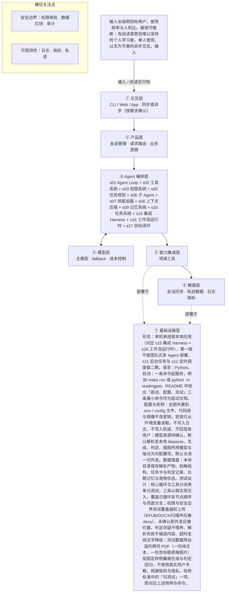

# PRD 推导方案 ——「读书养宠：你读的每一页都在喂养一只知识宠物」

> 状态：方案待确认（Step 1–4 已完成，Step 5 代码生成需确认后启动）
> 推导引擎：Agent Blueprint · 模型：anthropic

## 产品定位（一句话）

**读书养宠：你读的每一页都在喂养一只知识宠物**：给有阅读意愿但难以坚持的个人读者（是否面向儿童未确认），把一本 PDF 拆成每天 5 分钟的小任务，用答题或复述喂养一只随书中内容成长的宠物，用养成感替代连续打卡与排行榜的压力。

## ⚠️ 待确认清单（答不上就是风险点）

1. 产品目标要用哪句话定义？达到什么状态算做成（例如用户坚持天数、书籍完成率、任务完成率）？
2. 目标用户到底是谁？是成人自学者，还是像 Yomi 那样面向儿童朗读场景？使用频率如何，是同步实时交互还是异步（每天打开一次）？
3. 一次完整交付长什么样：任务卡上具体放什么（原文片段长度、题目形式、选项还是开放复述）？宠物反馈以文字、静态图还是别的形式给出？
4. 需要哪些外部动作与依赖：是否必须调用云端图像生成模型来产出“小黑角色”插图？是否需要账号体系、云存储或推送通道？这些系统的可用性与限流如何？
5. 领域知识在哪：一本书拆出的“章节、概念、规则、术语”用什么结构定义？复述题的参考答案与判定标准由谁提供或如何生成？宠物性格与房间的变化规则由什么决定？
6. 什么绝对不能做：用户上传书籍的版权与存放边界如何界定（能否上传到云端）？阅读行为与答题内容属隐私数据，可否用于训练或其他用途？宠物内容是否有内容安全红线？
7. 失败怎么办：PDF 解析失败或乱码、拆解出的概念质量差、复述题自动判定错误、插图生成超时或失败时，分别如何降级与告知用户？
8. 怎么算成功：有没有可度量的指标（每日任务完成率、次日回访率、单本书完成率、任务生成时延、单用户成本、复述判定准确率）？目标值是多少？
9. 产品点子写“上传 PDF/EPUB”，MVP 边界写“不支持 EPUB”，以哪个为准？EPUB 是本期就做还是排到后续版本？
10. 本方案落地形态是什么：纯本地工具、桌面应用还是 Web 服务？宠物状态与阅读记忆存在本地还是服务端？
11. 目标用户是谁、使用频率与人机比如何？是否面向儿童？（输入只提到所参考的 Yomi 面向孩子朗读喂猫，不能据此确认本产品面向儿童。）
12. 可量化成功标准是什么？现有 5/5 评分（新/好玩/实用/难度）属主观打分，不是业务指标。
13. 成功指标的定义与口径：任务完成率、次日回访、单卡用时、自评收获分别如何定义、在本地事件表中如何采集、目标值是多少？
14. 成本预算、并发量与时延要求均未给出，无法确定是否必须引入后台任务（s11）与定时调度（s12）。
15. 可用模型规格未给出：生成、判定、插图分别用什么模型或服务？是否允许把书内容外发给这些服务？
16. 复述题的判定标准与判定方式（规则、模型还是混合）未给出；判定为「存疑」时应有怎样的产品行为，需确认。
17. 「小黑角色」图像风格的具体规范未给出（参考图、尺寸、禁用元素）。
18. 产品点子处写「上传一本 PDF/EPUB」与 MVP 边界「不支持 EPUB」相冲突，以哪一个为准？
19. 书籍规模上限未确认（页数/字数），因此「解析产物与拆解结构体量远超单次上下文」缺乏输入依据，需确认。
20. 组件 s03（权限系统）的 feature 标为 destructive_ops，但其 reason 明确写「无删除、支付、对外发消息等破坏性动作」，两者矛盾，需规则侧修正；本方案按「私有阅读数据读写 + 无破坏性动作」设计。
21. 组件 s06（子 Agent）的依据在输入中不成立：按天按概念裁剪加载实际由 load_daily_knowledge_slice（属 s07/s08 范畴）承担，需确认是否真的需要子 Agent，或应改为待确认。
22. 组件 s08（上下文压缩）标为 long_sessions，但其理由讲的是大体积工具输出截断，标签与理由不符，且「大体积」同样无输入依据。
23. facts.users 的 value 中「有阅读意愿但难以坚持的个人学习者」为无出处推断，应与输入线索（单人使用、以天为节奏）拆开，分别呈现并单独标注待确认。
24. 本方案 tool_list 的层号映射（①到⑦）为方案自造，输入中没有该架构定义，需确认层定义，或改用输入已有的组件编号（s01–s17）标注归属。
25. 审批点：输入未定义任何需要人工审批的动作，是否需要在「书籍内容外发」「删除阅读记录」两处设置人工确认？
26. 阅读记录与薄弱概念的留存期限、使用范围与删除入口均未定义，需产品经理补充。
27. 【组件 s04 钩子系统】是否需要审计、拦截、埋点、合规记录？

## Step 1 · 需求拆解（提取硬事实）

| 维度 | 结论 | 状态 | 出处 |
|---|---|---|---|
| 目标 | 产品要完成的事：用户上传一本 PDF/EPUB，系统把书拆成每天 5 分钟的小任务；用户读完、回答一个问题或复述一个观点即可喂养宠物，宠物的性格和房间逐渐受到书中内容影响。可量化的成功标准：输入未给出，仅给出 MVP 自评“新 5/5｜好玩 5/5｜实用 5/5｜难度 2/5”，属主观打分而非业务指标。 | 待确认 | 上传一本 PDF/EPUB，系统拆成每天 5 分钟的小任务。读完、回答一个问题或复述一个观点，就能喂养宠物；宠物的性格和房间逐渐受到书中内容影响。／评分：新 5/5｜好玩 5/5｜实用 5/5｜难度 2/5。 |
| 用户 | 输入未指明目标用户、使用频率与人机比。最保守推断：有阅读意愿但难以坚持的个人学习者，单人使用、以天为节奏的异步交互。输入仅提到所参考的 Product Hunt Yomi 面向“孩子朗读喂猫”，无法据此确认本产品是否面向儿童。 | 待确认 | Product Hunt：Yomi 的创意点是“孩子朗读就能喂猫”，不是用连续打卡、排行榜制造压力。 |
| 核心闭环 | 一次完整闭环：用户上传 PDF →（liteparse 本地解析为带标题/表格/图片的 Markdown；book-to-skill 拆出章节、概念、规则、术语）→ 生成当天一张 5 分钟任务卡 → 用户阅读任务内容 → 回答一道复述题/观点复述 → 系统判定并给出宠物反馈（含固定“小黑角色”风格的插图）→ 宠物性格与房间状态更新 → 阅读行为与卡点写入长期记忆，影响下次任务。 | 明确 | 上传一本 PDF/EPUB，系统拆成每天 5 分钟的小任务。读完、回答一个问题或复述一个观点，就能喂养宠物；宠物的性格和房间逐渐受到书中内容影响。／每天一张任务卡。／一道复述题。 |
| 交付物 | 对用户的交付物：每日一张任务卡、宠物的文字与图像反馈（固定“小黑角色”风格的知识场景插图）、宠物性格与房间的成长状态、以及被记住的阅读进度与薄弱概念记录。不是代码、文档或对外操作交付。 | 明确 | 每天一张任务卡。／一只静态宠物。／一道复述题。／G19：生成固定“小黑角色”风格的知识场景和宠物反馈图。／G08：记住用户读过什么、卡在哪里、哪些概念经常忘记。 |
| 边界 | MVP 明确不做：只支持文本型 PDF，不支持 EPUB、DOCX、扫描件 OCR；每天只出一张任务卡；只有一只静态宠物；只有一道复述题；不用连续打卡、排行榜制造压力；本次只出方案、不生成产品代码。另注：产品点子处写“上传一本 PDF/EPUB”，与 MVP 边界“不支持 EPUB”相冲突，需澄清。 | 明确 | 只支持文本型 PDF，不支持 EPUB、DOCX、扫描件 OCR。／每天一张任务卡。／一只静态宠物。／一道复述题。／不用连续打卡、排行榜制造压力。／先方案后代码，本次不生成产品代码。 |
| 约束 | 输入明确的约束只有两条：单日任务时长约 5 分钟；解析走本地快速解析（liteparse）。时延、并发、合规、成本预算、可用模型规格均未给出，需产品经理补充。 | 待确认 | 拆成每天 5 分钟的小任务。／G18 run-llama/liteparse：本地快速解析 PDF，输出带标题、表格和图片的 Markdown。 |

## Step 2 · 领域建模（映射 Harness 五要素）

| 要素 | 内容 |
|---|---|
| **工具** | liteparse：本地快速解析 PDF，输出带标题、表格和图片的 Markdown。；book-to-skill：从书中拆出章节、概念、规则、术语。；图像生成能力：产出固定「小黑角色」风格的知识场景插图与宠物反馈图（所用模型/服务待确认）。；任务卡生成：按每天 5 分钟粒度生成每日一张任务卡与一道复述题。；复述判定：对用户回答的一道复述题做判定（判定标准与实现方式待确认）。；长期记忆：写入并召回用户读过什么、卡在哪里、哪些概念经常忘记。 |
| **知识** | 用户上传书籍的解析产物，即带标题、表格、图片的 Markdown。；book-to-skill 拆出的章节、概念、规则、术语结构。；长期记忆中的阅读进度、卡点与高频遗忘概念。；固定「小黑角色」风格的图像规范（具体规范内容待确认）。；MVP 边界规则：只支持文本型 PDF，每天一张任务卡，一只静态宠物，一道复述题，不用连续打卡和排行榜施压。；单日任务时长约 5 分钟的节奏约束。 |
| **观察** | 解析输出检查：Markdown 是否保留标题、表格、图片结构。；当日任务卡生成结果，数量应符合每天一张。；用户的复述作答内容与系统判定结果。；喂养后宠物性格与房间状态的变化。；长期记忆中阅读进度与薄弱概念记录的写入结果。 |
| **行动** | 用户在界面上传一本 PDF 文件。；在本地调用 liteparse 执行解析。；调用生成能力产出任务卡、复述题与宠物反馈图。；在界面渲染任务卡、宠物文字与图像反馈、宠物房间与性格状态。；把阅读行为与卡点写入长期记忆。 |
| **权限** | 用户上传的 PDF 走本地 liteparse 解析，是否向外部模型或服务外发书内容待确认。；默认拒绝超出边界的解析动作：EPUB、DOCX、扫描件 OCR 一律不处理（产品点子处写的「PDF/EPUB」与 MVP 边界冲突，需澄清）。；默认拒绝多任务卡、多宠物、连续打卡与排行榜等超出 MVP 边界的功能。；本次默认拒绝生成产品代码，只产出方案。；阅读记录与薄弱概念属个人数据，留存策略与使用范围待确认，未确认前不用于任务生成之外的用途。；输入未定义任何需要人工审批的动作，审批点待确认。 |

## Step 3 · 组件选型（宁可少选）

| 组件 | 选否 | 理由 | 参考 |
|---|---|---|---|
| s01 Agent Loop | ✅ 必选 | 一切基础：循环 + 工具（一切基础，恒选） | s01_agent_loop/README.md |
| s02 工具系统 | ✅ 必选 | 需要调用外部系统/API/数据源（一切基础，恒选） | s02_tool_use/README.md |
| s03 权限系统 | ✅ 必选 | 需读写用户私有的书籍内容与长期阅读行为记录（G08 记住用户读过什么、卡在哪里），属隐私数据处理；但无删除、支付、对外发消息等破坏性动作。 | s03_permission/README.md |
| s04 钩子系统 | ❓ 待确认 | 输入未说明：是否需要审计、拦截、埋点、合规记录？ | s04_hooks/README.md |
| s05 任务规划 | ✅ 必选 | 一次交付要经过解析→拆章节/概念→出任务卡→答题/复述→判定→宠物反馈，且以“每天一张任务卡”的进度节奏跨天推进。 | s05_todo_write/README.md |
| s06 子 Agent | ✅ 必选 | 整本 PDF 解析出的 Markdown 与拆解出的章节、概念、规则、术语体量可能远超单次上下文，需按天按概念裁剪加载。 | s06_subagent/README.md |
| s07 技能加载 | ✅ 必选 | G07 把整本 PDF/EPUB/DOCX 拆成章节、概念、规则和术语，构成需要按需检索加载的知识库。 | s07_skill_loading/README.md |
| s08 上下文压缩 | ✅ 必选 | G18 对整本 PDF 解析输出的带标题、表格、图片的 Markdown 属大体积工具输出，需截断或摘要。 | s08_context_compact/README.md |
| s09 记忆系统 | ✅ 必选 | G08 rohitg00/agentmemory：记住用户读过什么、卡在哪里、哪些概念经常忘记。 | s09_memory/README.md |
| s10 任务系统 | ✅ 必选 | 一本书被拆成每天 5 分钟任务，宠物的性格与房间状态需要跨天持续累积，天然要求目标与进度持久化。 | s10_task_system/README.md |
| s11 后台任务 | ⏸ 二期 | 输入只说明 liteparse 是“本地快速解析”，第一版可在用户等待中同步完成整本书解析与拆解，是否需异步后台任务待确认。 | s11_background_tasks/README.md |
| s12 定时调度 | ⏸ 二期 | “每天一张任务卡”存在日度节奏，但输入未要求定时自动触发（如定时推送），可先由用户打开时生成。 | s12_cron_scheduler/README.md |
| s13 Agent 团队 | ❌ 放弃 | MVP 只有一只静态宠物、每天一张任务卡，无多任务并行或隔离工作区需求。 | s13_agent_teams/README.md |
| s14 MCP 插件 | ⏸ 二期 | 能力来源是若干具体开源项目（liteparse、book-to-skill、agentmemory、插图生成），第一版可直接内嵌集成，未要求 MCP 或第三方插件生态。 | s14_mcp_plugin/README.md |
| s15 集成 Harness | ✅ 必选 | 第一版已选 9 个可选组件（s03, s05, s06, s07, s08, s09, s10, s16, s17），需归一到单一循环 | s15_integrated_harness/README.md |
| s16 工作流运行时 | ✅ 必选 | 日循环流程固定：解析→拆解→出卡→答题/复述→判定→宠物反馈→记忆更新，适合写死成工作流，模型只负责节点内的理解与生成。 | s16_workflow_runtime/README.md |
| s17 目标闭环 | ✅ 必选 | 需要自动判定用户的“复述一个观点/回答一个问题”是否合格，才能决定是否喂养宠物及宠物反馈。 | s17_goal_loop/README.md |

特征判定依据：

- `destructive_ops` = yes：需读写用户私有的书籍内容与长期阅读行为记录（G08 记住用户读过什么、卡在哪里），属隐私数据处理；但无删除、支付、对外发消息等破坏性动作。
- `audit_needed` = unknown：输入未提审计、拦截、埋点或合规记录要求，仅提到产品评分维度，无法判断。
- `multi_step` = yes：一次交付要经过解析→拆章节/概念→出任务卡→答题/复述→判定→宠物反馈，且以“每天一张任务卡”的进度节奏跨天推进。
- `context_heavy` = yes：整本 PDF 解析出的 Markdown 与拆解出的章节、概念、规则、术语体量可能远超单次上下文，需按天按概念裁剪加载。
- `large_knowledge` = yes：G07 把整本 PDF/EPUB/DOCX 拆成章节、概念、规则和术语，构成需要按需检索加载的知识库。
- `long_sessions` = yes：G18 对整本 PDF 解析输出的带标题、表格、图片的 Markdown 属大体积工具输出，需截断或摘要。
- `cross_session_memory` = yes：G08 rohitg00/agentmemory：记住用户读过什么、卡在哪里、哪些概念经常忘记。
- `persistent_goals` = yes：一本书被拆成每天 5 分钟任务，宠物的性格与房间状态需要跨天持续累积，天然要求目标与进度持久化。
- `slow_operations` = later：输入只说明 liteparse 是“本地快速解析”，第一版可在用户等待中同步完成整本书解析与拆解，是否需异步后台任务待确认。
- `scheduled` = later：“每天一张任务卡”存在日度节奏，但输入未要求定时自动触发（如定时推送），可先由用户打开时生成。
- `parallel_isolated` = no：MVP 只有一只静态宠物、每天一张任务卡，无多任务并行或隔离工作区需求。
- `external_ecosystem` = later：能力来源是若干具体开源项目（liteparse、book-to-skill、agentmemory、插图生成），第一版可直接内嵌集成，未要求 MCP 或第三方插件生态。
- `fixed_orchestration` = yes：日循环流程固定：解析→拆解→出卡→答题/复述→判定→宠物反馈→记忆更新，适合写死成工作流，模型只负责节点内的理解与生成。
- `auto_completion` = yes：需要自动判定用户的“复述一个观点/回答一个问题”是否合格，才能决定是否喂养宠物及宠物反馈。

## Step 4 · 架构设计

### 分层架构图（7 层 + 数据流）



| 层 | 名称 | 回答的问题 | 落地锚点 |
|---|---|---|---|
| ① | 交互层 | 谁在用、怎么用？ | CLI / Web / App / API；同步或异步；人机比 |
| ② | 产品层 | 产品外壳是什么？ | 会话管理、请求路由、账户、业务逻辑 |
| ③ | Agent 编排层 | Harness 如何运转？ | loop、工具分发、hooks、权限、记忆、任务、技能、压缩、子 agent / 团队、目标闭环 |
| ④ | 模型层 | 智能从哪来？ | 主模型、辅助模型、路由、fallback、成本 |
| ⑤ | 能力集成层 | 如何触达外部世界？ | 内部工具、MCP server、知识库、第三方 API |
| ⑥ | 数据层 | 什么需要持久化？ | 记忆、任务、会话历史、轨迹数据、日志指标 |
| ⑦ | 基础设施层 | 如何部署运行？ | 单进程 / 服务 / 团队、沙箱、队列、调度、监控 |

### 工具清单

| 工具 | 输入 | 输出 | 副作用 | 权限 | 归属层 |
|---|---|---|---|---|---|
| `parse_pdf_local` | 用户上传的文本型 PDF 文件（本地路径） | 带标题、表格、图片的 Markdown 文本，以及页数、失败页等解析元信息 | 在本地磁盘写入解析产物文件；不发起网络请求 | allow | ③（该层号映射为方案自造，待确认） |
| `extract_book_skills` | 上一步产出的 Markdown | 章节、概念、规则、术语的结构化清单 | 在本地磁盘写入拆解产物 | allow | ④（该层号映射为方案自造，待确认） |
| `load_daily_knowledge_slice` | 书籍拆解结构 + 用户阅读进度 + 长期记忆中的卡点与高频遗忘概念 + 当日 5 分钟预算 | 当日任务所需的知识切片（每条带原文出处标识） | 无写入；可能对超长原文触发截断或摘要 | allow | ④（该层号映射为方案自造，待确认） |
| `generate_daily_task_card` | 当日知识切片（含出处） | 一张任务卡：5 分钟阅读内容 + 一道复述题 | 写入当日任务记录；若使用外部生成模型则会外发书内容（是否外发待确认） | ask | ⑥（该层号映射为方案自造，待确认） |
| `judge_recall_answer` | 一道复述题 + 用户作答 + 该题对应的知识切片 | 判定结果（合格 / 不合格 / 存疑）与判定理由 | 判定结果写入任务记录；判定为存疑时不更新宠物状态、不做惩罚 | allow | ⑥（该层号映射为方案自造，待确认） |
| `generate_pet_feedback_image` | 书中概念或场景摘要 + 小黑角色图像规范 + 宠物当前性格与房间状态 | 一张固定「小黑角色」风格的知识场景插图 | 可能把概念摘要外发到图像服务（待确认）；生成图写入本地存储 | ask | ⑥（该层号映射为方案自造，待确认） |
| `update_memory_and_pet_state` | 当日任务完成情况、作答与判定结果、宠物反馈 | 更新后的阅读进度、卡点、薄弱概念记录，以及宠物性格与房间状态 | 把个人阅读数据写入本地长期记忆并跨天持久化 | allow | ⑤（该层号映射为方案自造，待确认） |
| `reject_non_pdf_source` | 任何非文本型 PDF 的上传（EPUB、DOCX、扫描件） | 拒绝说明与替代建议 | 记录一次被拒绝的上传事件（不含文件正文） | deny | ③（该层号映射为方案自造，待确认） |

### 系统提示词草案

```
你是「读书养宠」的阅读陪伴 Agent：把用户上传的文本型 PDF 拆成每天约 5 分钟的阅读任务，用户读完并回答一道复述题后给出宠物反馈，让宠物性格与房间随书中内容缓慢变化。

规则：
1. 边界：只处理文本型 PDF，EPUB、DOCX、扫描件一律拒绝并说明原因；每天一张任务卡、一道复述题、一只静态宠物；不得引入连续打卡、排行榜、断签惩罚等施压机制。
2. 质量底线：任务、题目与宠物反馈必须可追溯到解析产物或知识切片的原文，禁止编造书中没有的内容；不确定时直接说「书中未提到」。
3. 未经用户确认，不得把书籍原文或阅读记录发往外部服务；阅读记录只用于阅读陪伴。
4. 单日内容以 5 分钟读完为准，过长必须裁剪。

可用工具：parse_pdf_local、extract_book_skills、load_daily_knowledge_slice、generate_daily_task_card、judge_recall_answer、generate_pet_feedback_image、update_memory_and_pet_state。

知识目录：解析 Markdown（标题/表格/图片）、章节-概念-规则-术语结构、长期记忆中的阅读进度与薄弱概念、小黑角色图像规范、MVP 边界规则、5 分钟节奏约束。
```

### 上下文与记忆策略

会话内：不把整本书的 Markdown 放进上下文；解析产物落盘为文件，每次只加载 load_daily_knowledge_slice 产出的当日知识切片（每条带原文出处），超出当日 5 分钟预算的长输出先截断或摘要；本轮循环中保留当日任务卡、用户作答、判定结果与宠物反馈，用完即写盘释放。整本 Markdown 与拆解结构不进上下文，按需检索加载。跨会话：持久化书目与拆解结构、阅读进度、卡点与高频遗忘概念、宠物性格与房间状态、每日任务记录与判定结果；持久化内容仅用于任务生成与宠物反馈两处，是否可用于其他用途、留存多久均待确认，未确认前不外发、不用于他途。上下文预算与可用模型规格输入未给出，具体窗口分配待确认。

### 安全边界与降级策略

- 工具失败（liteparse 解析失败或产出为空）→ 中断当日流程，向用户报明失败页与原因，不生成任务卡、不喂养宠物，不编造内容补位。
- 工具失败（拆解或知识切片为空）→ 降级为按页或按段落切分的最小任务卡，并在卡片上标注「结构拆解不可用」。
- 模型幻觉（任务卡或宠物反馈出现书中没有的内容）→ 生成时必须附带原文出处，缺出处的句子一律丢弃；生成后做一次出处校验，不过则重生成一次，仍不过则直接改用原文摘录。
- 判定存疑（复述题判定标准输入未给出）→ 判定为「存疑」时不喂养、不惩罚，提示用户重述一次或跳过，并记录为待定事件交产品经理校准。
- 超时（生成或图像服务超时）→ 设单次调用超时上限，超时后先用纯文字宠物反馈补完闭环，插图标记为「稍后补」，不阻塞当日任务。
- 越权（上传 EPUB/DOCX/扫描件，或要求多任务卡、多宠物、排行榜）→ 走 reject_non_pdf_source 或直接 deny，明确说明 MVP 边界，不静默降级处理。
- 外发（书内容是否可发给生成/图像服务未确认）→ 默认不外发，只用本地能力；确需外发时以 permission=ask 先向用户确认，未确认前相关工具不调用。
- 隐私（阅读记录、卡点、薄弱概念属个人数据）→ 仅本地持有，仅用于任务生成与宠物反馈；日志与轨迹只记摘要标识，不记正文明文。

### 可观测性

- 日志：上传事件：文件名、页数、解析成功或失败及失败页（不记录书籍正文）。；工具调用：工具名、入参摘要（脱敏）、耗时、结果状态、是否走了兜底路径。；任务卡生成：任务卡编号、所引用知识切片的出处标识、所用生成路径。；判定与喂养：判定结果、是否更新宠物状态、更新前后性格与房间状态摘要。；越权拒绝：请求类型与拒绝原因。
- 指标：对齐产品目标（口径待确认）：日任务完成率＝当日生成的任务卡被完成的张数 / 当日生成张数。；对齐产品目标（口径待确认）：次日回访率＝完成当日任务的用户中，次日再次打开并完成任务的占比。；对齐产品目标（口径待确认）：单张任务卡实际用时分布，用于检验是否落在约 5 分钟。；对齐产品目标（口径待确认）：任务后自评收获分数（用户一元打分），对应现有「新/好玩/实用/难度 5/5」这类主观评分。；技术运行：解析成功率、工具调用失败率、生成与判定耗时 P50/P95、兜底路径触发次数、越权拒绝次数。
- 轨迹：按「一次日循环＝一条轨迹」记录：上传或取卡 → 知识切片 → 生成任务卡 → 用户作答 → 判定 → 宠物反馈 → 记忆与状态更新；每步记录时间戳、工具名、输入输出摘要（正文脱敏）与最终结果，按用户与日期索引，便于回放卡点、复现问题与核对判定。

### 技术栈与部署形态

形态：单机单进程本地应用（对应 s15 集成 Harness + s16 工作流运行时），第一版不做团队式多 Agent 部署，s11 后台任务与 s12 定时调度留二期。语言：Python。启动：一条命令起服务，例如 make run 或 python -m readingpet，README 中给出「启动、配置、测试」三条最小命令作为启动文档。配置与密钥：全部外置到 .env / config 文件，代码库与镜像不含密钥，密钥只从环境变量读取，不写入日志、不写入轨迹、不回显给用户；模型来源待确认，默认解析走本地 liteparse，生成、判定、插图所用模型与端点为可配置项，默认关闭一切外发。数据落盘：本地目录保存解析产物、拆解结构、任务卡与判定记录、长期记忆与宠物状态。测试设计：核心循环与工具分派用单元测试，工具以假实现注入，覆盖日循环各节点顺序与兜底分支；权限与安全边界测试覆盖越权上传（EPUB/DOCX/扫描件应被 deny）、未确认即外发应被拦截、判定存疑不喂养、解析失败不编造内容、超时走纯文字降级；测试数据用自造的两份 PDF（一份纯文本、一份含标题表格图片）加固定样例集做生成与判定回归，不使用真实用户书籍，规避版权与隐私。验收标准中的「可测试」一项，即对应上述用例与命令。

## 验收标准对照（可落地 vs demo）

| 标准 | 要求 | 本方案的对应设计 |
|---|---|---|
| 可运行 | 一条命令能起，配置与密钥外置（.env / config） | 形态：单机单进程本地应用（对应 s15 集成 Harness + s16 工作流运行时），第一版不做团队式多 Agent 部署，s11 后台任务与 s12 定时调度留二期。语言：Python。启动：一条命令起服务，例如 make run 或 python -m readingpet，README 中给出「启动、配置、测试」三条最小命令作为启动文档。配置与密钥：全部外置到 .env / config 文件，代码库与镜像不含密钥，密钥只从环境变量读取，不写入日志、不写入轨迹、不回显给用户；模型来源待确认，默认解析走本地 liteparse，生成、判定、插图所用模型与端点为可配置项，默认关闭一切外发。数据落盘：本地目录保存解析产物、拆解结构、任务卡与判定记录、长期记忆与宠物状态。测试设计：核心循环与工具分派用单元测试，工具以假实现注入，覆盖日循环各节点顺序与兜底分支；权限与安全边界测试覆盖越权上传（EPUB/DOCX/扫描件应被 deny）、未确认即外发应被拦截、判定存疑不喂养、解析失败不编造内容、超时走纯文字降级；测试数据用自造的两份 PDF（一份纯文本、一份含标题表格图片）加固定样例集做生成与判定回归，不使用真实用户书籍，规避版权与隐私。验收标准中的「可测试」一项，即对应上述用例与命令。 |
| 可容错 | 工具失败、模型幻觉、超时、越权都有明确降级路径 | 工具失败（liteparse 解析失败或产出为空）→ 中断当日流程，向用户报明失败页与原因，不生成任务卡、不喂养宠物，不编造内容补位。；工具失败（拆解或知识切片为空）→ 降级为按页或按段落切分的最小任务卡，并在卡片上标注「结构拆解不可用」。；模型幻觉（任务卡或宠物反馈出现书中没有的内容）→ 生成时必须附带原文出处，缺出处的句子一律丢弃；生成后做一次出处校验，不过则重生成一次，仍不过则直接改用原文摘录。 |
| 可观测 | 有日志、有指标、有轨迹数据 | 上传事件：文件名、页数、解析成功或失败及失败页（不记录书籍正文）。；工具调用：工具名、入参摘要（脱敏）、耗时、结果状态、是否走了兜底路径。；对齐产品目标（口径待确认）：日任务完成率＝当日生成的任务卡被完成的张数 / 当日生成张数。；对齐产品目标（口径待确认）：次日回访率＝完成当日任务的用户中，次日再次打开并完成任务的占比。 |
| 可测试 | 核心循环与工具分派有单测，权限与安全有边界测试 | Step 5 骨架层需附核心循环与权限边界的单测 |
| 可部署 | 有明确的部署形态（单进程 / 服务 / 团队）与启动文档 | 形态：单机单进程本地应用（对应 s15 集成 Harness + s16 工作流运行时），第一版不做团队式多 Agent 部署，s11 后台任务与 s12 定时调度留二期。语言：Python。启动：一条命令起服务，例如 make run 或 python -m readingpet，README 中给出「启动、配置、测试」三条最小命令作为启动文档。配置与密钥：全部外置到 .env / config 文件，代码库与镜像不含密钥，密钥只从环境变量读取，不写入日志、不写入轨迹、不回显给用户；模型来源待确认，默认解析走本地 liteparse，生成、判定、插图所用模型与端点为可配置项，默认关闭一切外发。数据落盘：本地目录保存解析产物、拆解结构、任务卡与判定记录、长期记忆与宠物状态。测试设计：核心循环与工具分派用单元测试，工具以假实现注入，覆盖日循环各节点顺序与兜底分支；权限与安全边界测试覆盖越权上传（EPUB/DOCX/扫描件应被 deny）、未确认即外发应被拦截、判定存疑不喂养、解析失败不编造内容、超时走纯文字降级；测试数据用自造的两份 PDF（一份纯文本、一份含标题表格图片）加固定样例集做生成与判定回归，不使用真实用户书籍，规避版权与隐私。验收标准中的「可测试」一项，即对应上述用例与命令。 |
| 可度量 | 有对齐 PRD 的成功指标，并能采集 | 对齐产品目标（口径待确认）：日任务完成率＝当日生成的任务卡被完成的张数 / 当日生成张数。；对齐产品目标（口径待确认）：次日回访率＝完成当日任务的用户中，次日再次打开并完成任务的占比。；对齐产品目标（口径待确认）：单张任务卡实际用时分布，用于检验是否落在约 5 分钟。；对齐产品目标（口径待确认）：任务后自评收获分数（用户一元打分），对应现有「新/好玩/实用/难度 5/5」这类主观评分。；技术运行：解析成功率、工具调用失败率、生成与判定耗时 P50/P95、兜底路径触发次数、越权拒绝次数。 |

## 独立审稿意见

- 结论：✅ 通过（82 / 100），设计稿共 2 版
- 总评：方案整体质量较高：闭环、边界、约束、五要素、工具清单与六条验收标准基本都有落点，安全降级完整覆盖工具失败、模型幻觉、超时、越权四类并额外处理了外发与隐私，且主动在 open_questions 中自曝多处证据不足，未见未标注的高危编造。主要遗留问题集中在组件选型与特征标签的一致性（s03 自相矛盾、s06 依据不成立、s08 标签与理由不符），以及自造层号框架、成功指标口径未闭合、facts 状态标注不精确等需要修正之处。建议按上述 medium 项修正后再进入实现。
- [medium] facts.users：value 中「有阅读意愿但难以坚持的个人学习者」「单人使用、以天为节奏的异步交互」属无出处推断，虽整条标为「待确认」，但仍以具体结论形式写在 facts 里，与输入线索（仅「不用连续打卡、排行榜制造压力」一条）混同。方案自身已在 open_questions 第 13 条点出该问题，但正文未修正。
- [low] facts.goal：目标陈述本身（上传 PDF/EPUB、拆成每天 5 分钟任务、读完答题喂养宠物、宠物性格与房间受书中内容影响）在原始输入中有逐句出处，却整条标为「待确认」。真正缺依据的只是「可量化成功标准」，状态标注把明确事实与待确认项混在一起，会误导下游判断目标的置信度。
- [medium] components.s06：子 Agent 判为「必选」、特征标 context_heavy，理由是「整本 PDF 的 Markdown 与拆解结构体量可能远超单次上下文」。但输入未给出书籍规模上限（方案自己在 open_questions 第 9、11 条承认该依据不成立），且该职责实际由 load_daily_knowledge_slice 承担、属 s07/s08 范畴。选型理由与可获得的特征证据不一致，且结论未降为「待确认」。
- [medium] components.s08：上下文压缩判为「必选」、特征标 long_sessions，但其理由讲的是「整本 PDF 解析输出属大体积工具输出，需截断或摘要」，对应的是工具输出体积而非长会话，特征标签与理由不匹配（方案自身在 open_questions 第 12 条已指出）。
- [medium] components.s03：权限系统判为「必选」、特征标 destructive_ops，但其理由明确写「无删除、支付、对外发消息等破坏性动作」，特征与理由自相矛盾。方案在 open_questions 第 10 条提出该矛盾，却在组件字段中未做修正，仍以矛盾标签进入选型结果。
- [medium] design.tool_list：每个工具都标注了「层号（①至⑦）」，但原始输入中没有任何层定义，该映射为方案自造。虽然每条后附了「待确认」，却仍作为结构化字段参与工具归属描述，存在把自造框架当作既有事实使用的风险；可改用输入已有的组件编号（s01–s17）标注归属。
- [medium] design.observability.metrics：「可度量」这一条验收标准未真正闭合：PRD 未给出成功指标（方案已在 facts.goal 承认），方案自造的 4 个指标口径、采集方式与目标值全部标为待确认，因此无法验证其「对齐 PRD」。这一点应在验收结论中明确标为未满足，而不只列在 open_questions。
- [low] elements.tools 与 design.tool_list：工具清单与五要素未双向对齐：elements.tools 未列出 load_daily_knowledge_slice 与 reject_non_pdf_source（后者实际归在 permissions 要素），design.tool_list 中的 8 个工具也无法逐一回溯到 elements.tools 的 6 项。整体可解释，但一致性未被显式声明。
- [low] design.system_prompt：系统提示词的「可用工具」只列出 7 个，遗漏 reject_non_pdf_source，与 design.tool_list 的 8 项不一致；越权拒绝动作虽在 security_and_degradation 有描述，但提示词层未同步。
- [low] design.security_and_degradation：「判定存疑…记录为待定事件交产品经理校准」中的产品行为（交 PM 校准）在原始输入中无依据，属方案自造；其余降级路径（工具失败、幻觉、超时、越权、外发、隐私）均可回溯到输入或已标待确认。

## 本次推导消耗

- 模型调用 0 次，输入 0 tokens，输出 0 tokens

## 下一步

回答上面的待确认清单，据此修订方案后，再进入 Step 5 代码生成（骨架 → 硬化 → 产品化）。
